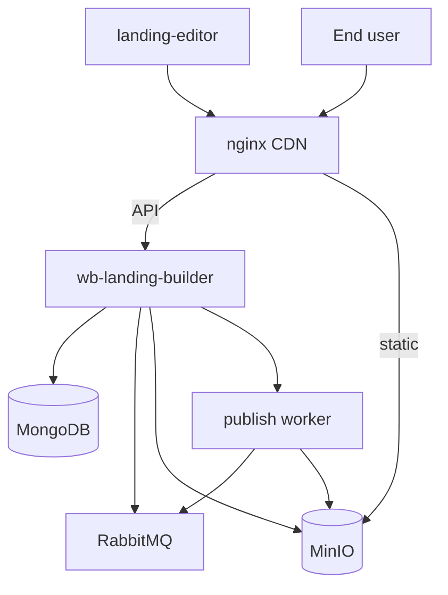

# ADR-0001: Монолитная архитектура backend MVP

> Backend конструктора лендингов — один процесс `wb-landing-builder` с логическими компонентами auth, storage, publishing.

---

| Поле | Значение |
| --- | --- |
| **Статус** | `Approved` |
| **Дата** | 2026-05-11 |
| **Авторы** | @WhatTheMUCK, @NamerPRO, @mregor787 |
| **Ревьюеры** | @Nifacy |
| **Supersedes** | Частично [Уточнения и детализация архитектуры](./Уточнения%20и%20детализация%20архитектуры.md) (микросервисная модель) |

---

## 1. Контекст и постановка задачи

### 1.1 Бизнес-логика и требования

Ключевые бизнес-процессы:

- Редактор создаёт и изменяет лендинг в визуальном клиенте ([`landing-editor`](https://github.com/rki-mai/landing-editor)).
- Backend хранит черновик, применяет мутации, контролирует доступ по пользователю.
- Публикация превращает черновик в статику для конечного пользователя.
- Посетитель просматривает опубликованную страницу без доступа к API редактирования.

Ожидания заказчика (MVP, локальная разработка):

| Метрика | Значение | Измерение |
| --- | --- | --- |
| Latency API (p99) | ≤ 500 ms | smoke-тест, curl |
| Доступность local stack | compose healthchecks `healthy` | `docker compose ps` |
| Пиковый RPS | десятки (учебный MVP) | не формализовано |

**Out of Scope (MVP):**

- Production-деплой в k8s WB
- Горизонтальное масштабирование API/worker
- Отдельные deployable-микросервисы
- gRPC между компонентами

**Ссылки:**

- [docs#12](https://github.com/rki-mai/docs/issues/12) — переписать ADR архитектуры под монолит
- [Task tracker](https://github.com/orgs/rki-mai/projects/1/views/3)
- [PR #9](https://github.com/rki-mai/docs/pull/9) — исходный ADR микросервисов

---

## 2. Предлагаемое решение

### 2.1 Диаграмма решения



```
landing-editor ──► nginx CDN :8080 ◄── End user
                        │
            ┌───────────┴───────────┐
            │ API                   │ static /publications
            ▼                       ▼
   wb-landing-builder            MinIO S3
            │
            ├── MongoDB
            ├── RabbitMQ
            └── publish worker ──► RabbitMQ, MinIO
```

**Точка входа:** `http://localhost:8080` (CDN). Подписи на Mermaid-диаграмме — ASCII, без пустых строк внутри блока (требование preview).

**Компоненты монолита:**

| Компонент | Путь в коде | Ответственность |
| --- | --- | --- |
| Auth | `auth/` | register, login, JWT, refresh |
| Storage | `storage/` | черновики, мутации, версии, `owner_id` |
| Publishing | `publishing/` | async publish, metadata, worker |

### 2.2 Модель данных и хранение

| Сущность | Хранилище | Прирост (MVP) | Стратегия |
| --- | --- | --- | --- |
| Users | MongoDB | десятки | один cluster |
| Drafts / elements | MongoDB | по project_id | TTL env `MONGO_TTL_DAYS` (30) |
| Publications | MongoDB + MinIO | по публикации | metadata в Mongo, HTML в S3 |

Шардирование **не требуется** на этапе MVP — объёмы учебного проекта.

### 2.3 API и интерфейсы

| Потребитель | Тип | Частота |
| --- | --- | --- |
| landing-editor | REST `/api/v1` | при редактировании |
| smoke.sh / Swagger | REST | тесты, ручная отладка |
| CDN / браузер | GET `/publications/*` | просмотр лендингов |

**Контракты:**

- OpenAPI: [`wb-landing-builder/docs/swagger.yaml`](https://github.com/rki-mai/wb-landing-builder/blob/main/wb-landing-builder/docs/swagger.yaml)
- Формат мутаций: [ADR-0003](./ADR-0003-Формат-мутаций-черновика.md)

| Метод | Путь | Описание |
| --- | --- | --- |
| POST | `/api/v1/auth/login` | JWT |
| POST | `/api/v1/storage/{project_id}/mutations` | мутация черновика |
| POST | `/api/v1/storage/{project_id}/publications` | создать публикацию |
| GET | `/publications/{id}/index.html` | просмотр (CDN) |

---

## 3. Information Security

| Тип данных | Обрабатывается? | Меры |
| --- | --- | --- |
| ПДн (email) | Да | MongoDB, dev defaults; prod — TBD |
| Платёжная информация | Нет | — |
| JWT / refresh tokens | Да | env `JWT_SECRET`, не в логах |

**Аутентификация:** JWT Bearer на `/api/v1/storage/*`.  
**Авторизация:** `owner_id` на уровне storage/publishing ([PR #21](https://github.com/rki-mai/wb-landing-builder/pull/21)).  
Gateway (nginx) не проверяет business-права.

---

## 4. Интеграции и зависимости

| Сервис | Тип | При отказе | Ответственный |
| --- | --- | --- | --- |
| MongoDB | sync | API не стартует | @NamerPRO |
| RabbitMQ | async | publish → FAILED / не enqueue | @WhatTheMUCK |
| MinIO | sync/async | publish FAILED; CDN 404 | @WhatTheMUCK |
| landing-editor | client | нет UI | @Nifacy |
| landing-builder-cli | subprocess | render FAILED | @WhatTheMUCK |

---

## 5. Альтернативы

| Альтернатива | Плюсы | Минусы | Почему отказались (MVP) |
| --- | --- | --- | --- |
| **Монолит (выбрано)** | проще dev/deploy, одна кодовая база | сложнее масштабировать части | размер команды и срок MVP |
| Микросервисы (ADR #9) | независимый scale/deploy | overhead, сеть, больше репозиториев | отложено; ADR #9 частично superseded |
| Serverless publish | auto-scale | сложность локальной отладки | нет инфра WB в учебном проекте |

---

## 6. Технический долг

| Компромисс | Причина | Когда устраним | Тикет |
| --- | --- | --- | --- |
| Worker in-process (не отдельный сервис) | MVP, один контейнер | при росте нагрузки | — |
| ADR «микросервисы» не обновлён | docs#12 в backlog | после согласования | [docs#12](https://github.com/rki-mai/docs/issues/12) |
| Dev JWT secret по умолчанию | локальная разработка | перед prod | — |
| Production observability отсутствует | нет prod | при деплое | — |

---

## 7. Декомпозиция

**Видение:** один docker-compose поднимает API, worker, CDN, Mongo, MinIO, RabbitMQ; редактор работает через REST.

| Задача | Статус | PR / issue |
| --- | --- | --- |
| Storage компонент | ✅ | [wb-landing-builder#1](https://github.com/rki-mai/wb-landing-builder/pull/1) |
| Auth компонент | ✅ | [#4](https://github.com/rki-mai/wb-landing-builder/pull/4) |
| Docker refactor | ✅ | [#8](https://github.com/rki-mai/wb-landing-builder/pull/8) |
| Swagger | ✅ | [#17](https://github.com/rki-mai/wb-landing-builder/pull/17) |
| owner_id | ✅ | [#21](https://github.com/rki-mai/wb-landing-builder/pull/21) |
| Frontend integration | ✅ | [landing-editor#24](https://github.com/rki-mai/landing-editor/pull/24) |

---

## 8. Test Notes

- [x] Smoke: register → mutations → publish → CDN HTML ([`scripts/smoke.sh`](https://github.com/rki-mai/wb-landing-builder/blob/main/scripts/smoke.sh))
- [x] ACL: чужой project_id → 403
- [x] Semantic HTTP codes (не только 500) — [PR #24](https://github.com/rki-mai/wb-landing-builder/pull/24)
- [ ] Интеграционные тесты docker-образа — [wb-landing-builder#13](https://github.com/rki-mai/wb-landing-builder/issues/13)

| Сценарий | Ожидаемое поведение |
| --- | --- |
| Mongo down при старте | контейнер API unhealthy |
| RabbitMQ down при POST publish | `FAILED` или ошибка enqueue |
| Rate limit мутаций | `429` + `Retry-After` |

---

## 9. Observability

**MVP:** логи stdout (`docker compose logs`), smoke-тест, Swagger healthcheck.

| Метрика | MVP | Prod (цель) |
| --- | --- | --- |
| Error rate | ручной анализ логов | алерт > 5% |
| Latency p99 | smoke | Grafana |
| Queue depth | RabbitMQ UI :15672 | алерт |

Structured JSON logs — частично; полноценный Grafana **не настроен**.

---

## 10. Pre-release checklist

### MVP (local)

- [x] ADR Approved командой
- [x] Code review через GitHub PR
- [x] `make test-smoke` проходит
- [ ] Нагрузочное тестирование — не проводилось (обосновано MVP)

### Production

- [ ] Runbook опубликован — [Runbook.md](../Runbook.md) (отдельный PR)
- [ ] Секреты в Vault, не в compose
- [ ] TLS на CDN/API

---

## 11. План релиза и отката

**MVP:** `docker compose up -d --build` / `make restart`.

**Rollback local:** `docker compose down -v && up --build` (потеря данных) или checkout предыдущего git tag образа.

**Production:** не применимо на текущем этапе.
