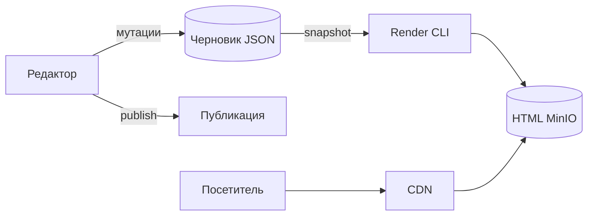

# ADR-0002: Разделение черновика и публикации

> Лендинг в режиме редактирования и в режиме просмотра — разные сущности с разным представлением данных.

---

| Поле | Значение |
| --- | --- |
| **Статус** | `Approved` |
| **Дата** | 2026-04-02 |
| **Авторы** | @WhatTheMUCK, @NamerPRO, @Nifacy |
| **Ревьюеры** | команда РКИ |
| **Decision Log** | [DL-002](../Decision-Log.md) |

---

## 1. Контекст и постановка задачи

### 1.1 Бизнес-логика

- **Контур редактирования:** частые изменения, структурированные данные, версионирование, мутации.
- **Контур эксплуатации:** редкие изменения, быстрая отдача статики, CDN, без API.

Единая сущность «лендинг» неоптимальна для обоих контуров ([исходный документ](./Разделение%20лендинга.md)).

**Out of Scope:**

- Автоматическая синхронизация черновика → публикация без явного действия редактора
- WYSIWYG-редактирование опубликованной страницы in-place

---

## 2. Предлагаемое решение

### 2.1 Диаграмма

### 2.2 Модель данных

| Сущность | Представление | Хранение |
| --- | --- | --- |
| **Черновик (Draft)** | дерево элементов `lb-*`, version | MongoDB, API `/storage/` |
| **Публикация (Publication)** | статические файлы HTML/CSS/JS | MinIO + metadata MongoDB |

### 2.3 API

| Операция | API |
| --- | --- |
| Редактирование | `POST …/mutations`, `GET …/storage/{project_id}` |
| Публикация | `POST …/publications` |
| Просмотр | `GET /publications/{id}/index.html` (CDN) |

---

## 3. Information Security

| Данные | Черновик | Публикация |
| --- | --- | --- |
| Доступ | JWT + owner | Публичный read |
| ПДн в контенте | возможны в текстах лендинга | то же в HTML |

---

## 4. Интеграции

Зависит от [ADR-0001](./ADR-0001-Монолитная-архитектура-MVP.md) и [ADR-0004](./ADR-0004-Асинхронная-публикация-и-CDN.md).

---

## 5. Альтернативы

| Альтернатива | Минусы | Решение |
| --- | --- | --- |
| Одна сущность + flag `published` | смешение контуров, сложный CDN | отклонено |
| **Draft + Publication (выбрано)** | два lifecycle | принято |

---

## 6. Технический долг

| Компромисс | Тикет |
| --- | --- |
| Полный bundle (CSS/JS/медиа) — заглушка `index.html` | [docs#19](https://github.com/rki-mai/docs/issues/19) |

---

## 7–11. Декомпозиция, тесты, observability, release

- Реализовано: storage + publishing pipeline, CDN
- Тест: smoke создаёт publication и читает HTML
- Pre-release MVP: ✅ для локального стека
