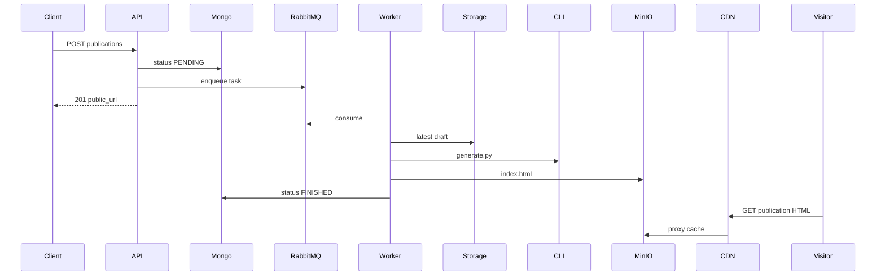

# ADR-0004: Асинхронная публикация и CDN

> Публикация через RabbitMQ worker; публичная статика через nginx CDN → MinIO.

---

| Поле | Значение |
| --- | --- |
| **Статус** | `Approved` |
| **Дата** | 2026-06-01 |
| **Авторы** | @WhatTheMUCK |
| **Ревьюеры** | @NamerPRO |
| **Supersedes** | Частично [Сервис публикации лендингов.md](./Сервис%20публикации%20лендингов.md) (отдельный Publish Service + sync HTTP) |

---

## 1. Контекст

Синхронная публикация в HTTP-запросе блокирует handler и не масштабируется ([исходный ADR публикации](./Сервис%20публикации%20лендингов.md)).  
Реализация: [PR #27](https://github.com/rki-mai/wb-landing-builder/pull/27), [docs#8](https://github.com/rki-mai/docs/issues/8).

**Out of Scope MVP:** полная сборка CSS/JS/медиа ([docs#19](https://github.com/rki-mai/docs/issues/19)).

---

## 2. Решение

### 2.1 Pipeline

### 2.2 Статусы Publication

`PENDING` → `PROCESSING` → `FINISHED` | `FAILED`

### 2.3 CDN

- nginx `docker/cdn/nginx.conf`
- `/api/*` → backend; `/publications/*` → MinIO bucket `publications`
- `PUBLIC_BASE_URL` для поля `public_url`
- CDN hardening: [PR #46](https://github.com/rki-mai/wb-landing-builder/pull/46) (review)

---

## 3. Security

| Контур | Auth |
| --- | --- |
| POST/GET/DELETE publications API | JWT + owner |
| GET /publications/* | без auth (public read) |

---

## 4. Альтернативы

| Альтернатива | Почему нет |
| --- | --- |
| Sync publish в HTTP | блокировка, timeout |
| Backend proxy статики | нагрузка на Go, [issue #26](https://github.com/rki-mai/wb-landing-builder/issues/26) |
| **Async + CDN** | разгрузка API, кэш | ✅ |

---

## 5. Технический долг

| Компромисс | Тикет |
| --- | --- |
| Worker in-process | ADR-0001 |
| HTML-only bundle | docs#19 |
| CLI render в контейнере | [landing-builder-cli#1](https://github.com/rki-mai/landing-builder-cli/pull/1) |

---

## 6. Test Notes

- [x] smoke: PENDING → FINISHED ≤ 60s
- [x] FAILED + error_message при ошибке CLI/S3
- [ ] CDN cache HIT/MISS — ручная проверка `X-Cache-Status`

---

## 7. Observability

- RabbitMQ UI: queue `publish.requests`
- MinIO console: path `publications/{id}/index.html`
- Логи: `Publication worker started`, `Failed to process publish task`
