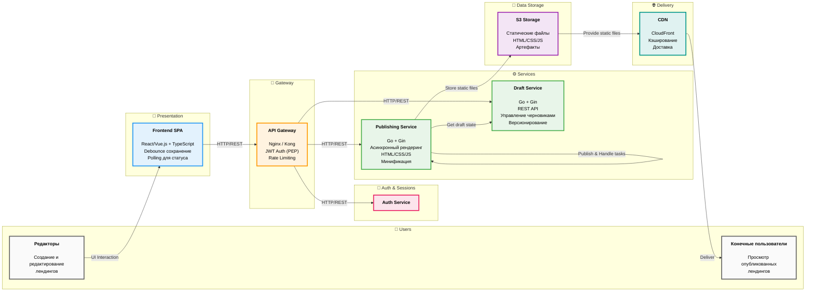
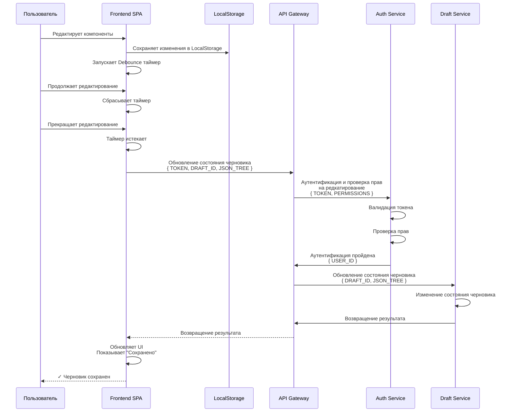
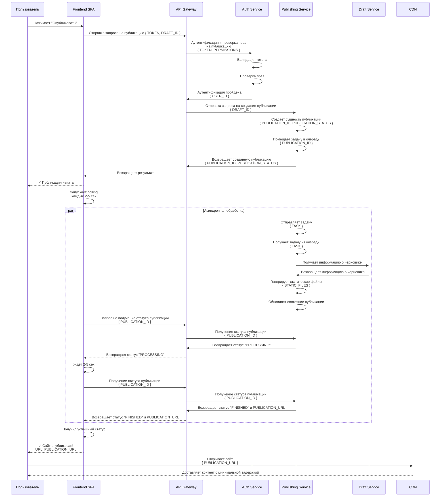
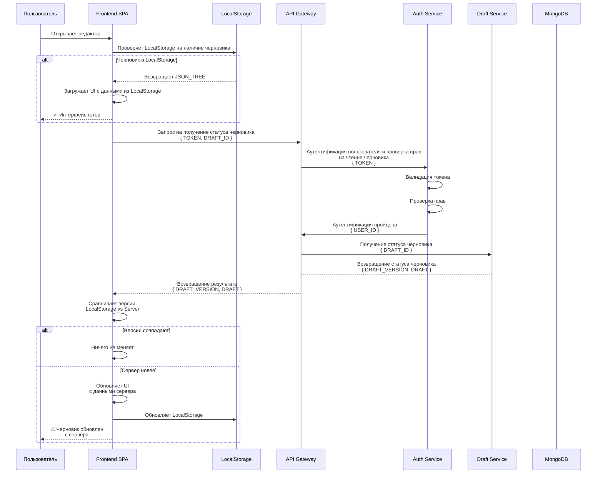

# Архитектура сервиса "Конструктор лендингов"

## 1. Общие понятия, принципы и инфраструктура

### 1.1 Архитектурный подход

В проекте придерживаемся идеи микросервисов. Логику декомпозируем в виде сервисов, которые независимы и у которого четка определена зона ответственности.

При разработке придерживаемся идеи [Contract-First](https://lightboxapi.ru/blog/contract-first-development). То есть, перед реализацией
сервисов четко описываем их API. Это обеспечивает слабую связанность микросервисом, что упрощает их масштабирование и позволяет заменять
или обновлять отдельные части системы без влияния на работу целого, так как общение происходит только на основе контрактов.

### 1.2 Deployment сервисов

При разработке проекта мы придерживаемся идеи контейнеризации. Каждый сервис будет предоставлять Docker образ,
на основе которого можно будет запустить контейнер с целевым сервисом.

Так мы добиваемся воспроизводимости: приложение ведет себя идентично как на этапе локальной разработки,
так и на производственном сервере.

### 1.3 Основные понятия и определения

* **Система управления контентом (Content Management System, CMS)** - программное обеспечение, которое позволяет
  создавать, редактировать и управлять содержимым веб-сайта без глубоких знаний программирования.

* **Черновик (Draft)** - состояние страницы, которое находится в работе. Обозначает версию, которую сейчас редактирует пользователь.

* **Публикация (Publish)** - неизменяемый снимок черновика. Обозначает готовое для просмотра целевой аудиторией состояние страницы. 

* **Компонент (Widget/Block)** - атомарный или составной элемент интерфейса (например: кнопка, заголовок, форма захвата, галерея),
  который пользователь может добавлять в лендинг и настраивать через панель свойств. Компоненты являются строительными блоками лендинга.

* **Версионирование (Versioning)** - механизм сохранения истории изменений черновика. Позволяет откатываться к предыдущим состояниям
  страницы и восстанавливать удаленные элементы.

* **Версия страницы (Page Version)** - уникальный номер, который присваивается каждой версии черновика. Система поддерживает откат
  до любой ранее созданной версии, если не была включена настройка автоматического удаления старых версий.

---

# 2. Логические компоненты системы

### 2.1. API Gateway (Шлюз)

#### Зачем нужен

Сервис отделяет фронтенд от внутренней кухни бэкенда и выносит общую логику (безопасность, лимиты) в одно место.

#### Почему вынесли в отдельный сервис

- Безопасность: Вся проверка токенов (JWT) и защита от спама (Rate Limiting) теперь в одном месте.
  Не нужно писать этот код в каждом микросервисе, и взломать систему становится сложнее.

- Свобода изменений для бэкенда: API Gateway играет роль фасада, а следовательно ему свойственны
  и все его положительные стороны. Фронтенд не знает, как устроены сервисы внутри.
  Мы можем менять, делить или объединять сервисы на бэкенде, не трогая код клиентского приложения.
  Свобода касается и в выборе протоколов. Сервис внутри могут использовать быстрые протоколы, такие
  как gRPC, в то время как клиентам доступны простые HTTP-запросы.

### За что отвечает

- Направление запросов к внутренним сервисам.
- Аутентификацию и авторизацию.

### 2.2. Frontend Client (Клиентское приложение)

#### Зачем нужен

Данный компонент предназначен для того, чтобы пользователям было удобнее работать с системой.
Очевидно, что им будет приятнее работать с системой визуально, чем отправлять HTTP запросы.

### 2.3. Draft Service (Сервис черновиков)

#### Зачем нужен

Так как в начале было сказано, что мы придерживаемся идеи микросервисов, то по возможности
стоит распределить зоны ответственности между отдельными сервисами. Через данный микросервис
мы выносим зону ответственности за жизненный цикл черновиков.

#### Почему вынесли в отдельный сервис

Все причины в принципе обосновываются выбором микросервисной архитектуры:

- Легкость в масштабировании: мы можем при необходимости масштабировать мощности для выполнения
  логики с черновиками, если текущих мощностей будет нехватать. И наоборот, если окажется, что
  мощностей слишком много, мы можем их уменьшить, убрав лишние инстансы.

- Гибкость изменений: внутренние изменения сервиса, не влияющие на протокол взаимодействия с ним,
  никак не повлияют на работу остальных частей системы.

- Гибкость деплоя: выполнив изменения в одном сервисе, у нас нет необходимости проводить деплой,
  сборку остальной части системы.

### 2.4. Publishing Service (Сервис публикаций)

#### Зачем нужен

Так как в начале было сказано, что мы придерживаемся идеи микросервисов, то по возможности
стоит распределить зоны ответственности между отдельными сервисами. Через данный микросервис
мы выносим зону ответственности за рендер лендингов.

#### Почему вынесли в отдельный сервис

Все причины обосновываются выбором микросервисной архитектуры:

- Гибкость в управлении ресурсами: так как потенциально рендер лендингов будет одной из самых ресурсоемких операций,
  то мы можем заложить под нее больше мощностей. При этом у нас не возникает необходимости в увеличении
  мощностей других частей системы.

- Гибкость изменений: внутренние изменения сервиса, не влияющие на протокол взаимодействия с ним,
  никак не повлияют на работу остальных частей системы.

- Гибкость деплоя: выполнив изменения в одном сервисе, у нас нет необходимости проводить деплой,
  сборку остальной части системы.

### 2.5. Auth Service (Сервис аутентификации, авторизации и управления сессиями)

#### Зачем нужен

Аутентификация / валидация пользователей критически важна для нашего проекта во избежание
невалидных сценариев, когда один пользователь получает доступ к данным другого доступа и управлению
ими. Сервис предназначен для контроля доступа пользователей к системе.

#### Почему вынесли в отдельный сервис

- Безопасность: такие чувствительные данные хранить в API Gateway критически опасно. При
  возможности их стоит вынести в отдельное место и дать только ограниченный доступ к ней
  (Нельзя просто так взять, и считать все credentials пользователей и делать с ними, что угодно).

- Снятие нагрузки с API Gateway: так как API Gateway и так будет очень нагруженным из-за того,
  что играет точку доступа для клиентов (то есть, весь трафик проходит через него), то по возможности
  его надо разгрузить, вынося логику в отдельные сервисы. Тогда задача API Gateway будет заключаться
  просто в координации запросов между сервисами.

---

## 2.3. Диаграмма архитектуры системы

---

## Usecases

### Сохранение черновика

### Публикация лендинга

### Восстановление сессии

