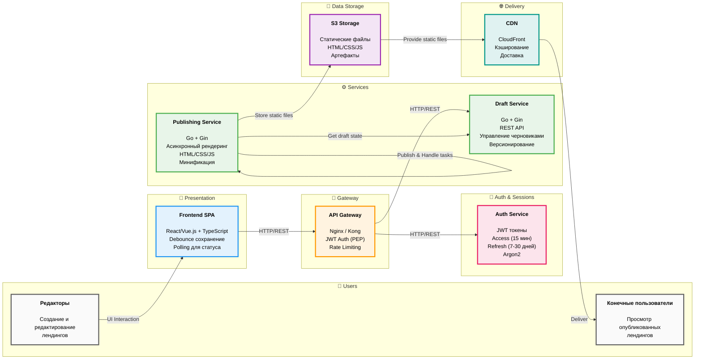
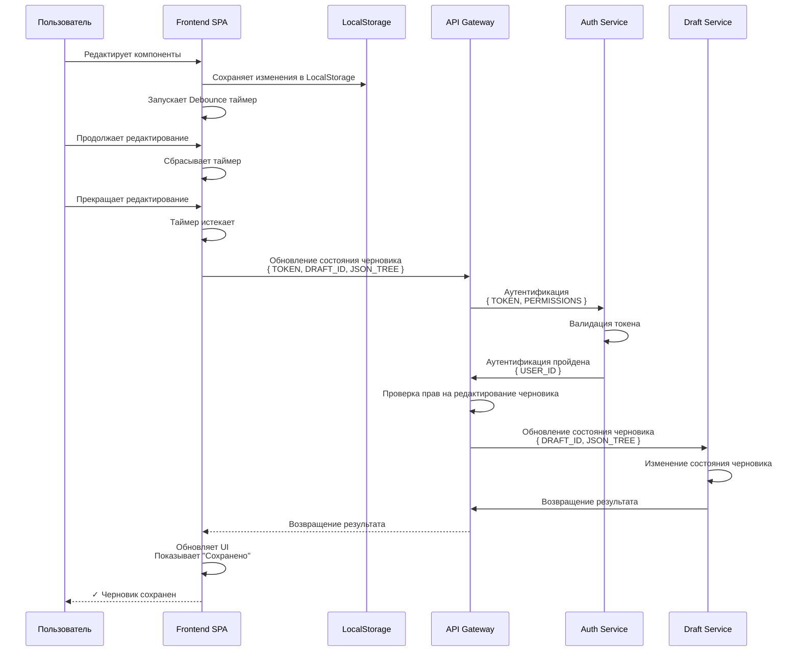
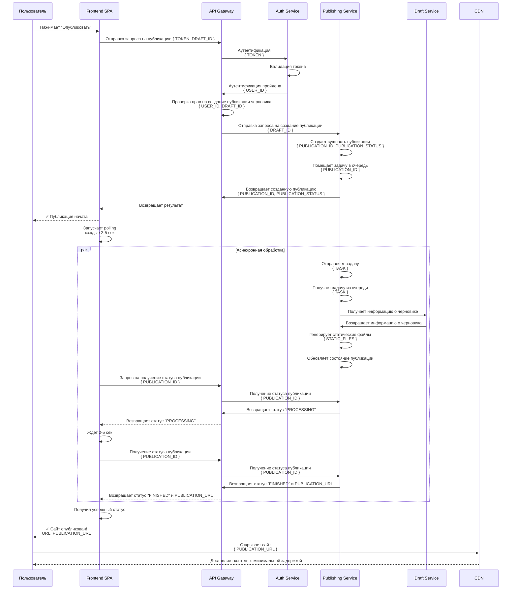
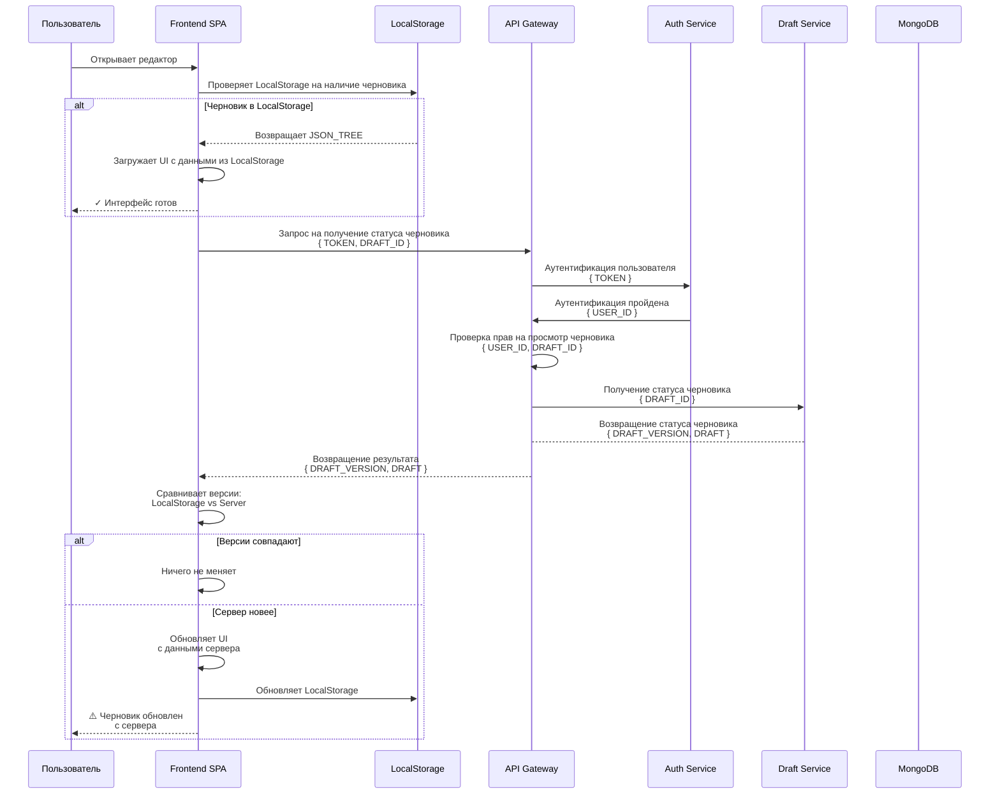

# Архитектура сервиса "Конструктор лендингов"

## 1. Общие понятия, принципы и инфраструктура

### 1.1 Архитектурный подход

В проекте придерживаемся идеи микросервис. Логику декомпозируем в виде сервисов, которые независимы и у которого четка определена зона ответственности.

При разработке придерживаемся идеи [Contract-First](https://lightboxapi.ru/blog/contract-first-development). То есть, перед реализацией реализацией сервисов четко описываем их API. Это обеспечивает слабую связанность микросервисом, что упрощает их масштабирование и позволяет заменять или обновлять отдельные части системы без влияния на работу целого, так как общение происходит только на основе контрактов.

### 1.2 Deployment сервисов

При разработке проекта мы придерживаемся идеи контейнеризации. Каждый сервис будет предоставлять Docker образ, на основе которого можно будет запустить контейнер с целевым сервисом.

Так мы добиваемся воспроизводимости: приложение ведет себя идентично как на этапе локальной разработки, так и на производственном сервере.

### 1.3 Основные понятия и определения

* **Система управления контентом (Content Management System, CMS)** - программное обеспечение, которое позволяет создавать, редактировать и управлять содержимым веб-сайта без глубоких знаний программирования.

* **Черновик (Draft)** - состояние страницы, которое находится в работе. Обозначает версию, которую сейчас редактирует пользователь.

* **Публикация (Publish)** - неизменяемый снимок черновика. Обозначает готовое для просмотра целевой аудиторией состояние страницы. 

* **Компонент (Widget/Block)** - атомарный или составной элемент интерфейса (например: кнопка, заголовок, форма захвата, галерея), который пользователь может добавлять в лендинг и настраивать через панель свойств. Компоненты являются строительными блоками лендинга.

* **Холст (Canvas)** - центральная рабочая область редактора, где визуально отображается структура лендинга в режиме реального времени. Позволяет пользователю видеть изменения сразу после применения настроек к компонентам.

* **Версионирование (Versioning)** - механизм сохранения истории изменений черновика. Позволяет откатываться к предыдущим состояниям страницы и восстанавливать удаленные элементы.

* **Версия страницы (Page Version)** - уникальный номер, который присваивается каждой версии черновика. Система поддерживает откат до любой ранее созданной версии, если не была включена настройка автоматического удаления старых версий.

* **Шаблон (Template)** - предустановленный набор компонентов и их начальной конфигурации, служащий основой для быстрого создания нового лендинга.

* **Стили (Styles)** - набор правил оформления (шрифты, цвета, отступы), применяемых ко всему проекту или конкретному его элементу, обеспечивающий восприятие лендинга.

* **Предпросмотр (Preview)** - режим симуляции опубликованной страницы внутри среды разработки. Позволяет проверить адаптивность, работу интерактивных элементов и логику форм без создания реальной публикации.

---

# 2. Логические компоненты системы

### 2.1. API Gateway (Шлюз)

Единая точка входа для всего внешнего трафика от клиентского приложения. Выступает фасадом для клиентских приложений, скрывая внутреннюю структуру микросервисов.

Сервис отвечает за:
- Направление запросов к внутренним сервисам.
- Аутентификацию и авторизацию.

### 2.2. Frontend Client (Клиентское приложение)

Одностраниченое приложение, выполняет роль точки входа для запуска и работы конструктора лендингов.

Через этот интерфейс пользователь может:
* Управлять компонентами страницы.
* Настраивать свойства компонентов.
* Предпросмотр изменений.
* Публиковать черновик.

Для того, чтобы не нагружать backend-часть частыми запросами, frontend client будет использовать следующую стратегию:
* Сначала данные сохраняются в локальном хранилище браузера. Можно использовать стратегию [debounce](https://doka.guide/js/debounce/).
- По наступлении какого-то события отправляет запрос в backend для синхронизации состояния.

### 2.3. Draft Service (Сервис черновиков)

Отвечает за жизненный цикл черновиков:
- Создание черновиков.
- Изменение последней версии черновика.
- Создание новой версии черновика.
- Откат до определенной версии черновика.

В качестве хранилища используется MongoDB.

### 2.4. Publishing Service (Сервис публикаций)

Отвечает за трансформацию данных из черновика в публикацию, в частности за:
* Создание публикаций.
* Удаление публикаций.
* Получение информации о публикации.

Создание публикаций происходит в фоновом режиме: сервис создает сущность публикации, а задачу на трансформацию складывает в очередь.

В результате трансформации должны быть созданы статические файлы (HTML / CSS / JS), которые пригодны для отображения в браузере.

### 2.5. Auth Service (Сервис аутентификации, авторизации и управления сессиями)

Ключевая задача сервиса - надежная верификация и идентификация пользователей. Сервис отвечает за:
* Хранение credentials пользователей.
* Авторизацию: генерация токена на основе введенных credentials.
* Аутентификацию: валидация отправленного токена.
* Регистрацию: сохранение credentials нового пользователя.

Более детальная валидация прав пользователя осуществляется со стороны сервисов. К примеру, ограничение на то, что пользователь может редактировать только свои публикации, реализуется со стороны Draft Service.

---

## 2.3. Диаграмма архитектуры системы

---

## Usecases

### Сохранение черновика

### Публикация лендинга

### Восстановление сессии

