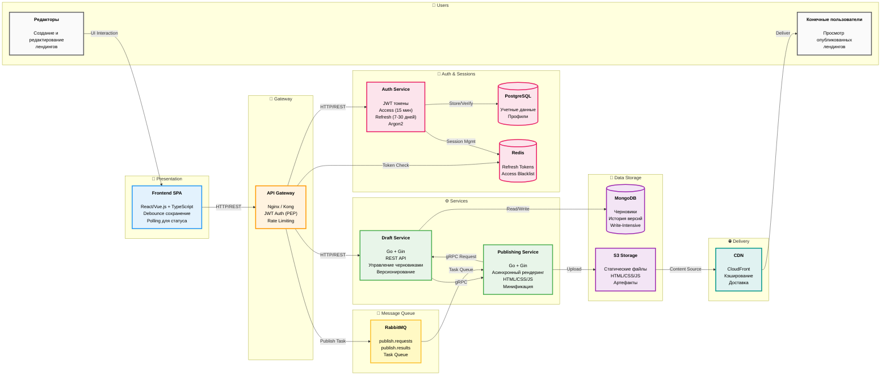
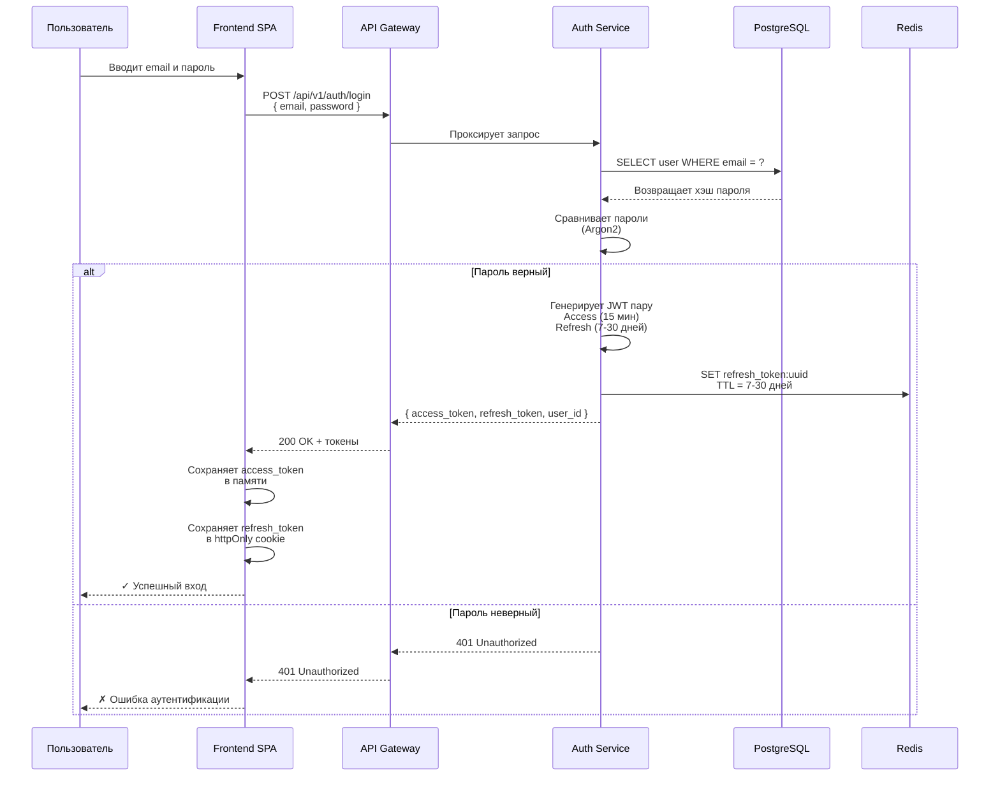
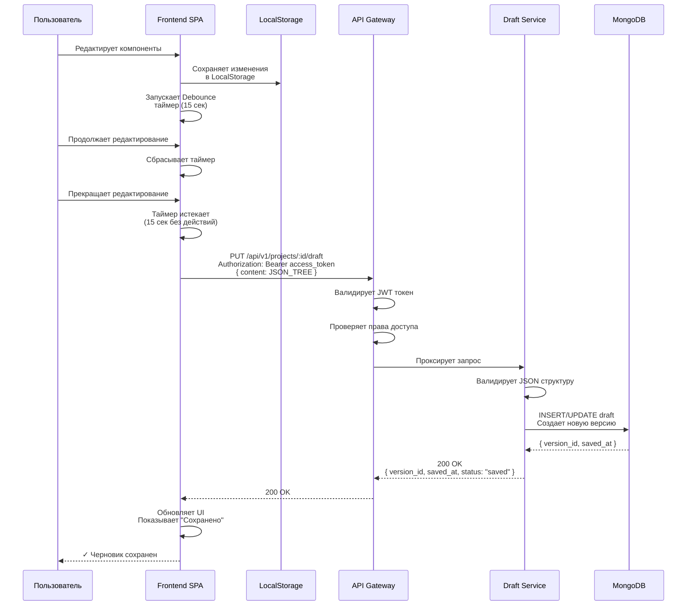
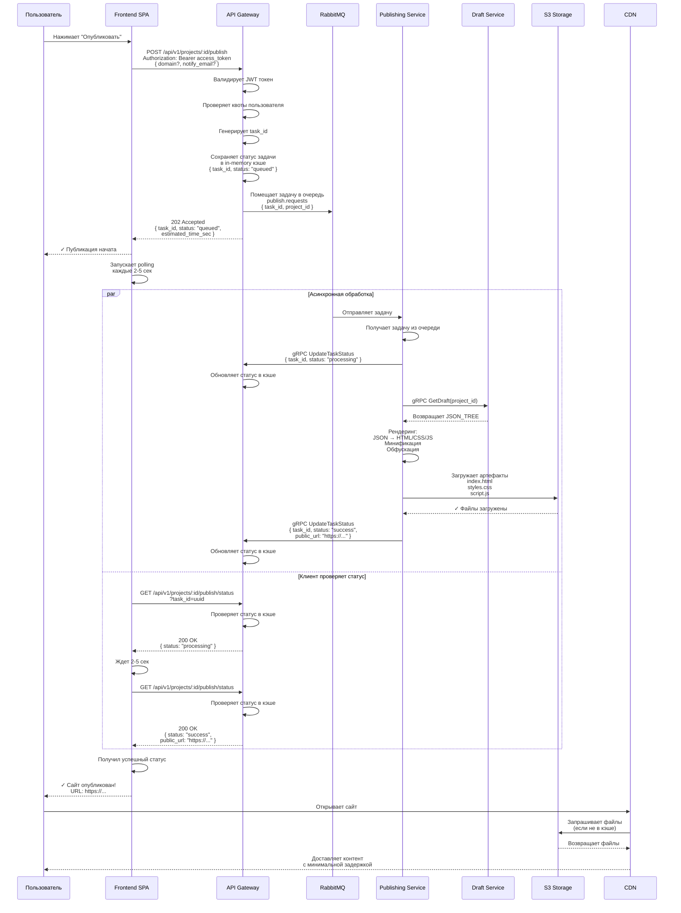
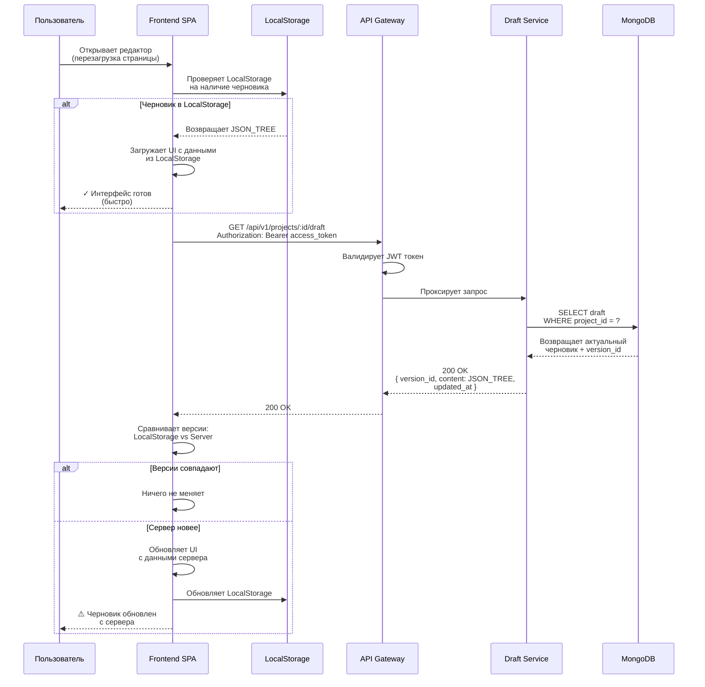
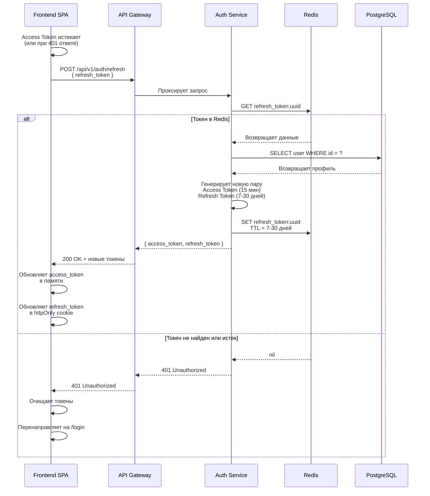

# Архитектура сервиса "Конструктор лендингов"

## 1. Общие понятия, принципы и инфраструктура

### 1.1. Технологический базис и принципы построения
Фундаментом системы служит подход полной контейнеризации, при котором каждый логический компонент упаковывается в изолированный Docker-контейнер. Это решение гарантирует абсолютную воспроизводимость окружения: приложение ведет себя идентично как на этапе локальной разработки, так и на производственном сервере, полностью исключая проблемы с зависимостями и конфигурацией. Архитектурно система реализована по принципу микросервисов, где каждый элемент представляет собой независимый модуль с четкой зоной ответственности. Взаимодействие между этими модулями строго регламентировано и осуществляется исключительно через четко определенные программные интерфейсы (API), что обеспечивает слабую связанность компонентов, упрощает их масштабирование и позволяет заменять или обновлять отдельные части системы без влияния на работу целого.

### 1.2 Основные понятия и определения
* **Система управления контентом (Content Management System, CMS)** - программное обеспечение, которое позволяет создавать, редактировать и управлять содержимым веб-сайта без глубоких знаний программирования.
* **Черновик (Draft)** - техническое состояние страницы (JSON), которое находится в работе. В архитектуре CMS обозначает редактируемую версию.
* **Публикация (Publish)** - неизменяемый снимок черновика (HTML/CSS/JS), работа над которым завершена. В архитектуре CMS обозначает готовое для просмотра целевой аудиторией состояние страницы. 
* **Компонент (Widget/Block)** - атомарный или составной элемент интерфейса (например: кнопка, заголовок, форма захвата, галерея), который пользователь может добавлять в лендинг и настраивать через панель свойств. Компоненты являются строительными блоками лендинга.
* **Холст (Canvas)** - центральная рабочая область редактора, где визуально отображается структура лендинга в режиме реального времени. Позволяет пользователю видеть изменения сразу после применения настроек к компонентам.
* **Версионирование (Versioning)** - механизм сохранения истории изменений черновика. Позволяет откатываться к предыдущим состояниям страницы и восстанавливать удаленные элементы.
* **Версия страницы (Page Version)** - уникальный номер, который присваивается каждой версии черновика. Система поддерживает откат до любой ранее созданной версии, если не была включена настройка автоматического удаления старых версий.
* **Шаблон (Template)** - предустановленный набор компонентов и их начальной конфигурации, служащий основой для быстрого создания нового лендинга.
* **Стили (Styles)** - набор правил оформления (шрифты, цвета, отступы), применяемых ко всему проекту или конкретному его элементу, обеспечивающий восприятие лендинга.
* **Предпросмотр (Preview)** - режим симуляции опубликованной страницы внутри среды разработки. Позволяет проверить адаптивность, работу интерактивных элементов и логику форм без создания реальной публикации.

---

# 2. Логические компоненты системы

## 2.1. Назначение раздела
В данном разделе компоненты системы описываются как отдельные сущности с их задачами и ответственностями, без углубления в детали реализации. Система состоит из следующих логических компонентов: API Gateway (Шлюз), Frontend Client (Клиентское приложение), Draft Service (Сервис черновиков), Publishing Service (Сервис публикаций), Auth Service (Сервис аутентификации, авторизации и управления сессиями).

## 2.2. Описание логических компонентов
В данном разделе описаны функциональные единицы системы, их ответственность и границы взаимодействия.

### 2.2.1. API Gateway (Шлюз)
Единая точка входа для всего внешнего трафика от клиентского приложения. Выступает фасадом для клиентских приложений, скрывая внутреннюю структуру микросервисов. Обеспечивает маршрутизацию: направление запросов к внутренним сервисам, безопасность: аутентификацию и авторизацию (валидация JWT-токенов, проверка прав доступа, квот), наблюдаемость: логирование и сбор метрик входящего трафика.

### 2.2.2. Frontend Client (Клиентское приложение)
Клиентское приложение представляет собой современное одностраничное приложение (SPA), которое выступает единой точкой входа для запуска и работы конструктора лендингов. В его интерфейсе реализован полный цикл визуального редактирования: интуитивное управление компонентами страницы, тонкая настройка их свойств и мгновенный предпросмотр изменений. Для обеспечения высокой отзывчивости и надежности приложение использует гибридную стратегию сохранения данных: критические изменения сначала фиксируются в локальном хранилище браузера (как по запросу пользователя так и через определенный промежуток времени бездействия (debounce)), а затем порционно синхронизируются с бэкендом. Такой подход не только минимизирует нагрузку на сервер за счет оптимизации сетевых запросов, но и гарантирует сохранность работы пользователя благодаря встроенному механизму автоматического автосохранения. По готовности лендинга клиентское приложение инициирует процесс его публикации.

### 2.2.3. Draft Service (Сервис черновиков)
Сервис черновиков выступает ядром системы редактирования, отвечая за полный жизненный цикл черновиков: от их надежного сохранения и детального версионирования до выдачи актуального состояния страницы. Этот сервис является центральным узлом данных, предоставляющим информацию как клиентскому приложению для продолжения работы пользователя, так и сервису публикаций для генерации финального сайта. Хранение данных организовано в высокопроизводительном операционном хранилище, оптимизированном для работы со сложными иерархическими структурами, такими как JSON-деревья компонентов. Критически важной функцией сервиса является обеспечение восстановления сессии: при разрыве соединения пользователь может вернуться к последнему сохраненному состоянию без значительных потерь данных. Для взаимодействия с другими микросервисами системы используется высокопроизводительный бинарный протокол, что гарантирует минимальные задержки при передаче объемных структур данных внутри серверного контура.

### 2.2.4. Publishing Service (Сервис публикаций)
Сервис публикаций функционирует как асинхронный фоновый воркер, ключевая задача которого - трансформация сырых данных черновика в готовый к эксплуатации веб-сайт. Сервис запускает движок рендеринга, который преобразует сложную JSON-структуру страницы в набор оптимизированных статических артефактов: чистый HTML-код, таблицы стилей CSS и исполняемые скрипты JS. Процесс не ограничивается простой конвертацией: сервис автоматически применяет оптимизации минификации кода, сжатие ресурсов и обфускацию, что обеспечивает максимальную скорость загрузки финального сайта для конечных пользователей. Работая в асинхронном режиме, этот компонент позволяет системе обрабатывать задачи публикации параллельно, гарантируя стабильность даже при высоких нагрузках.

### 2.2.5. Auth Service (Сервис аутентификации, авторизации и управления сессиями)
Auth Service функционирует как централизованный модуль безопасности и управления идентификацией, ключевая задача которого - надежная верификация пользователей и контроль доступа ко всем ресурсам системы. Сервис реализует механизм аутентификации на основе пары JWT-токенов (Access и Refresh), обеспечивая баланс между удобством непрерывной работы и строгой защитой данных. Сервис автоматически применяет современные алгоритмы хэширования паролей для их безопасного хранения, управляет жизненным циклом сессий через высокоскоростное кэширование и обеспечивает возможность мгновенного отзыва доступа при выходе пользователя. Сервис гарантирует, что только авторизованные пользователи могут инициировать операции редактирования черновиков или запуска публикации, тем самым защищая периметр всей платформы от несанкционированного вмешательства.

---

## 2.3. Диаграмма архитектуры системы

---

# 3. Инфраструктурные зависимости

## 3.1 Назначение раздела
В данном разделе описываются зависимости, обеспечивающие хранение данных, асинхронное взаимодействие и доставку контента. Сервис использует следующие инфраструктурные зависимости: RabbitMQ (Брокер сообщений), MongoDB (Основное хранилище данных), S3 (Объектное хранилище артефактов), CND (Сеть доставки контента).

## 3.2 Описание инфраструктурных зависимостей

### 3.2.1 RabbitMQ (Брокер сообщений)
RabbitMQ действует как надежный буфер и диспетчер задач, развязывая во времени отправителя запроса (Frontend через API Gateway) и исполнителя (Publishing Service). Его основная задача - гарантировать доставку команд на публикацию даже при пиковых нагрузках или временной недоступности сервиса рендеринга. Когда поступает запрос на генерацию сайта, RabbitMQ помещает его в очередь, где задача ожидает свободного воркера, что предотвращает потерю данных и позволяет системе гибко масштабировать количество обрабатывающих узлов без изменения логики приложения.

### 3.2.2 MongoDB (Основное хранилище данных)
MongoDB служит основным операционным хранилищем данных, выступая в роли «долговременной памяти» для сервиса черновиков. Эта документоориентированная база данных выбрана благодаря своей способности эффективно хранить и манипулировать сложными иерархическими структурами в формате JSON, которые представляют собой деревья компонентов лендинга. Её ключевая функция - обеспечение высокой скорости записи для частых операций автосохранения и поддержка гибкой схемы данных, позволяющей легко эволюционировать структуре черновика без дорогостоящих миграций. MongoDB надежно сохраняет не только актуальное состояние страницы, но и полную историю её версий, давая пользователю возможность отката к любому предыдущему моменту работы.

### 3.2.3 S3 (Объектное хранилище артефактов)
S3 функционирует как масштабируемое объектное хранилище артефактов, являющееся финальным пунктом назначения для сгенерированных публикаций. Этот компонент представляет собой надежный «цифровой склад», куда Publishing Service загружает готовые статические файлы (HTML, CSS, JavaScript, изображения) после завершения рендеринга. Его главная задача — обеспечить долговечное, избыточное и дешевое хранение больших объемов неизменяемого контента, готового к раздаче. S3 выступает фундаментальной основой для работы CDN: именно из этого хранилища сеть доставки забирает файлы для кэширования и последующей передачи конечным пользователям, обеспечивая высокую доступность сайтов.

### 3.2.4. Content Delivery Network (Сеть доставки контента)
Content Delivery Network (CDN) в текущей архитектуре выступает логическим уровнем доставки контента, завершающим процесс публикации. Этот компонент представляет собой связку объектного хранилища (S3) и веб-сервера, который раздает готовые файлы пользователям. Его основная задача — эффективно хранить сгенерированные статические файлы (HTML, CSS, JS) и отдавать их по запросу с минимальной задержкой.

# 4 Архитектура конпонентов системы

## 4.1 Назначение раздела
Этот раздел описывает реализацию логических компонентов системы, обоснование выбранных методов реализации с их сравнением с альтернативными подходами, а также взаимодействие компонентов друг с другом и внешние сервисы. Архитектура системы состоит из логических компонентов, которые взаимодействуют друг с другом, используя инфраструктурные зависимости.

## 4.2 Описание архитектуры компонентов

### 4.2.1 Принцип разделения данных (Черновик/Публикация)
Архитектура системы фундаментально базируется на строгом разделении двух независимых контуров: процесса редактирования и режима эксплуатации. Такое разграничение позволяет оптимизировать производительность редактора для работы автора, не завися от потенциально огромной нагрузки, которую создают посетители на опубликованных сайтах. В основе этого подхода лежит различие в природе сущностей: черновик представляет собой динамическую модель данных в виде изменяемого дерева компонентов и их настроек, тогда как публикация является статическим, неизменяемым артефактом — финальным снимком системы, готовым к использованию.
Форматы представления данных также кардинально отличаются. Черновик хранится и передается в виде структурированного JSON-объекта, содержащего всю логику, привязки данных и мета-информацию, необходимую рендереру для построения страницы. Публикация же трансформируется в набор автономных статических файлов (HTML, CSS, JavaScript и медиа), которые браузер конечного пользователя может исполнять напрямую без дополнительной обработки на сервере. Стратегия хранения адаптирована под эти различия: для черновиков используется операционное хранилище (Operational DB), оптимизированное под интенсивную запись (Write-Intensive) и транзакционность, что критично для частых операций автосохранения и ведения истории версий. Для публикаций применяется объектное хранилище в связке с CDN, ориентированное на массовое чтение (Read-Intensive) и высокую пропускную способность для доставки контента широкой аудитории.
Жизненный цикл этих сущностей также подчиняется разным правилам. Черновик существует в единственном актуальном экземпляре на каждый проект (с сохранением истории изменений), доступ к которому имеет только автор. Напротив, система поддерживает множественные версии публикаций: каждое действие «Опубликовать» создает новый неизменяемый снимок. Ключевым принципом этой архитектуры является полная независимость публикации от черновика после момента её создания. Это гарантирует, что любые изменения, вносые автором в текущий черновик, никак не влияют на уже работающие в сети версии сайтов до тех пор, пока не будет инициирован процесс новой публикации.

### 4.2.2 Draft Service: Управление состоянием и версионированием
Draft Service является ядром системы редактирования, отвечающим за жизненный цикл черновиков. Его основная задача — обеспечение надежного сохранения изменений пользователя и поддержание целостности истории версий. Сервис спроектирован с учетом паттерна Write-Intensive (интенсивная запись), так как он должен обрабатывать поток операций сохранения, инициируемых редактором.
Для хранения данных выбрано документоориентированное хранилище MongoDB. Это решение продиктовано природой данных: структура лендинга представляет собой сложное, глубоко вложенное JSON-дерево компонентов, которое может динамически меняться. Реляционные базы данных потребовали бы сложной нормализации, тогда как MongoDB нативно оптимизирована для хранения и выборки таких документов. Использование объектных хранилищ (S3) для черновиков было отвергнуто из-за высокой латентности записи и отсутствия поддержки транзакций на уровне отдельных полей, что критично для предотвращения потери данных при сбоях.
Ключевой особенностью взаимодействия Frontend и Draft Service является использование стратегии Debounce (отсрочка) поверх стандартного REST API. Вместо отправки запроса на сервер после каждого действия пользователя (что создало бы избыточную нагрузку), клиентское приложение накапливает изменения локально. Таймер запускается при первом изменении и сбрасывается при каждом последующем. Запрос на сохранение отправляется на сервер только тогда, когда пользователь прекращает активные действия на протяжении заданного интервала (в данной архитектуре — 15 секунд). Такой подход кардинально снижает количество HTTP-запросов к бэкенду, уменьшает сетевой трафик и нагрузку на базу данных, сохраняя при этом приемлемую частоту автосохранения для защиты от потери данных.
При восстановлении сессии (например, после перезагрузки страницы или разрыва соединения) Frontend выполняет стандартный GET-запрос через API Gateway к Draft Service для получения последней сохраненной версии черновика. Сервис мгновенно возвращает полный JSON-снимок состояния, позволяя пользователю продолжить работу с актуальными данными. Для внутреннего взаимодействия, когда Publishing Service запрашивает черновик для рендеринга, используется протокол gRPC. Прямое соединение сервисов через gRPC (минуя шлюз) выбрано для минимизации накладных расходов на сериализацию и сетевые задержки. Поскольку процесс рендеринга чувствителен к скорости получения исходных данных, бинарный протокол обеспечивает необходимую пропускную способность внутри серверного контура.

При проектировании архитектуры сервиса черновиков были рассмотренны альтернативы.

#### 4.2.2.1 Альтернативы для стратегии хранения данных

##### Альтернатива 4.2.2.1.1

Постоянное соединение WebSocket.
- Преимущества: Мгновенная синхронизация, поддержка совместного редактирования (multi-user), отсутствие задержки сохранения.
- Недостатки: Высокая сложность инфраструктуры (stateful-соединения, сложная балансировка), высокое потребление ресурсов сервера в простое, усложнение логики восстановления сессии.
- Вердикт: Отклонено. Избыточно для индивидуального редактирования. Риск потери работы в выбранном решение приемлем ради упрощения архитектуры и масштабирования stateless REST-сервисов.

##### Альтернатива 4.2.2.1.2

Сохранение при каждом действии (Eager Saving).
- Преимущества: Минимальный риск потери данных (секунды), простота реализации на клиенте (нет таймеров).
- Недостатки: Катастрофическая нагрузка на сеть и базу данных при активном редактировании (сотни запросов в минуту), высокая вероятность троттлинга API и блокировок БД, ухудшение отзывчивости интерфейса из-за очереди запросов.
- Вердикт: Отклонено. Неэффективное использование ресурсов. Debounce снижает нагрузку на порядки при приемлемом уровне риска.

##### Альтернатива 4.2.2.1.3

Хранение только в LocalStorage браузера.
- Преимущества: Нулевая нагрузка на сервер во время редактирования, мгновенная работа интерфейса.
- Недостатки: Высокий риск полной потери данных при очистке кэша, поломке устройства или переключении браузера/устройства, отсутствие истории версий на сервере, невозможность совместной работы или восстановления администратором.
- Вердикт: Отклонено. Недопустимый риск потери данных пользователей. Серверное хранение является обязательным требованием надежности.

#### 4.2.2.2 Альтернативы для базы данных черновиков:

##### Альтернатива 4.2.2.2.1

Реляционная СУБД (PostgreSQL) с JSONB.
- Преимущества: ACID-транзакции, мощные возможности для связей между сущностями (пользователи, проекты, права доступа), зрелость экосистемы.
- Недостатки: Менее гибкая схема для эволюции структуры виджетов, потенциально более высокая нагрузка на CPU при работе с глубокими вложенными JSON по сравнению с документными БД, сложность миграции структуры данных.
- Вердикт: Отклонено. Гибкость схемы и скорость записи произвольных JSON-документов являются приоритетом. MongoDB лучше подходит для итеративной разработки структуры компонентов.

##### Альтернатива 4.2.2.2.2

Объектное хранилище (S3/MinIO) для каждого сохранения.
- Достоинства: Дешевизна хранения, бесконечная масштабируемость, встроенное версионирование объектов.
- Недостатки: Высокая латентность записи (не подходит для частых обновлений), отсутствие транзакционности (риск рассинхронизации метаданных и файла), неэффективность для частичных обновлений или частых чтений последних версий.
- Вердикт: Отклонено. S3 оптимизирован для редкой записи больших файлов, а не для частых транзакционных обновлений маленьких документов.

### 4.2.3 Publishing Service: Асинхронный рендеринг
Publishing Service отвечает за трансформацию динамического черновика в статический, оптимизированный сайт. Ключевой архитектурной особенностью этого компонента является полная асинхронность процесса. Пользователь не должен ждать завершения генерации сайта в интерфейсе редактора; система принимает задачу и обрабатывает её в фоновом режиме.
Алгоритм публикации строго регламентирован. Процесс инициируется REST-запросом от Frontend, который проходит через API Gateway. Шлюз выполняет критически важные функции безопасности: валидирует JWT-токен пользователя, проверяет права доступа и контролирует квоты. Только после успешной проверки шлюз помещает задачу в очередь сообщений RabbitMQ.
Выбор RabbitMQ вместо синхронного HTTP-вызова или других брокеров (как Kafka) является стратегическим решением. Синхронный вызов привел бы к блокировке интерфейса пользователя на время рендеринга, а также создал бы риск потери задачи при таймауте соединения. RabbitMQ идеально подходит для паттерна «Task Queue»: он гарантирует доставку сообщения. Если воркер рендеринга упадет в процессе обработки, сообщение автоматически вернется в очередь и будет подхвачено другим доступным воркером, обеспечивая высокую отказоустойчивость.
Воркер Publishing Service, забрав задачу из очереди, устанавливает прямое gRPC-соединение с Draft Service для получения актуальной версии черновика. Обход API Gateway внутри периметра доверия позволяет избежать лишней маршрутизации и ускорить обмен большими объемами данных. Получив JSON-структуру, движок рендеринга трансформирует её в набор статических артефактов (HTML, CSS, JS). На этом этапе применяются алгоритмы оптимизации: минификация кода и обфускация скриптов. Сгенерированные файлы загружаются в объектное хранилище S3.
После завершения загрузки файлов в S3, Publishing Service отправляет событие, которое может быть проверено клиентом. Frontend-приложение, используя механизм периодического опроса (polling), узнает о завершении публикации и обновляет интерфейс пользователя, сообщая о готовности сайта.

При проектировании архитектуры были рассмотренны следующие альтернативы.

#### 4.2.3.1 Альтернативы для механизма обработки задач публикации

##### Альтернатива 4.2.3.1.1

Синхронный HTTP-рендеринг (Request-Response).
- Достоинства: Простота реализации, мгновенный ответ клиенту об успехе/ошибке.
- Недостатки: Блокировка UI пользователя на время рендеринга (плохой UX), риск HTTP-таймаутов при генерации больших сайтов, невозможность очерединги и приоритизации задач, падение сервиса рендеринга приводит к потере запроса.
- Вердикт: Отклонено. Критически важно не блокировать интерфейс редактора. Асинхронность обеспечивает лучший UX и отказоустойчивость.

##### Альтернатива 4.2.3.1.2

Использование Apache Kafka вместо RabbitMQ.
- Достоинства: Экстремальная пропускная способность, хранение истории событий, возможность повторной обработки потоков данных несколькими потребителями.
- Недостатки: Избыточная сложность эксплуатации (Zookeeper, управление топиками), модель «лог событий» менее удобна для паттерна «очередь задач» с подтверждением выполнения (ACK), высокие требования к ресурсам.
- Вердикт: Отклонено. Нужна надежная доставка единичных задач конкретному воркеру, а не обработка потоков телеметрии. RabbitMQ проще, легче и идеален для Task Queue.

##### Альтернатива 4.2.3.1.3

Планировщик задач на базе базы данных (Database Polling).
- Достоинства: Не требует внедрения нового инфраструктурного компонента (брокера), простота понимания.
- Недостатки: Высокая нагрузка на БД из-за постоянного опроса таблицы задач (busy waiting), проблемы с конкурентным доступом (гонки за задачи), плохая масштабируемость, задержки в обработке.
- Вердикт: Отклонено. Создание лишней нагрузки на основную БД черновиков недопустимо. Выделенный брокер сообщений (RabbitMQ) эффективнее управляет очередями и разгружает базу данных.

Альтернативы для протокола внутренней связи (Service-to-Service):

##### Альтернатива 4.2.3.1.4

REST API через внутренний шлюз.
- Достоинства: Единый стиль коммуникации, простота отладки через браузер/cURL, универсальность.
- Недостатки: Накладные расходы на HTTP-заголовки и парсинг JSON, высокая латентность по сравнению с бинарными протоколами, отсутствие строгой типизации контрактов (без OpenAPI), сложнее реализовать стриминг больших данных.
- Вердикт: Отклонено. Для передачи объемных JSON-черновиков внутри доверенного контура важна максимальная скорость. gRPC дает выигрыш в производительности и строгую типизацию.

##### Альтернатива 4.2.3.1.5

GraphQL для внутренних запросов.
- Достоинства: Гибкость выборки данных (клиент запрашивает только нужные поля), уменьшение объема передаваемых данных.
- Недостатки: Высокая сложность реализации серверной части (резолверы), риски сложных запросов (DoS через глубокие вложения), кэширование сложнее, чем в REST/gRPC, избыточность для сценария «забрать весь документ целиком».
- Вердикт: Отклонено. В сценарии рендеринга сервису всегда нужен полный документ черновика. Гибкость выборки полей не требуется, а накладные расходы GraphQL неоправданны.

#### 4.2.3.2 Альтернативы для уведомления клиента о готовности

##### Альтернатива 4.2.3.2.1:

WebSocket Push (Server-Sent Events).
- Достоинства: Мгновенное уведомление, экономия трафика (нет лишних запросов).
- Недостатки: Требует поддержания постоянного соединения (противоречит выбранной стратегии отказа от WebSocket), усложняет архитектуру шлюза.
- Вердикт: Отклонено. Мы сознательно выбрали архитектуру без постоянных соединений для упрощения.

##### Альтернатива 4.2.3.2.2:

Long Polling.
- Достоинства: Эмуляция пуша на стандартном HTTP, быстрее обычного polling.
- Недостатки: Удержание соединений на сервере, сложность реализации при балансировке, все еще создает нагрузку на сервер при большом числе клиентов.
- Вердикт: Отклонено. Обычный периодический polling (раз в 2-5 секунд во время ожидания) достаточно эффективен для редкого события публикации и проще в реализации.

### 4.2.4 Auth Service: аутентификация, авторизация и управление сессиями
Auth Service является центральным узлом безопасности системы, отвечающим за идентификацию пользователей, выдачу токенов доступа и управление правами. В отличие от stateless-сервисов, этот компонент хранит состояние сессий (для возможности принудительного разлогина) и управляет жизненным циклом учетных данных.
Основой механизма аутентификации выбран подход на базе JWT (JSON Web Tokens) с использованием пары токенов: короткоживущего Access Token (15 минут) и долгоживущего Refresh Token (7–30 дней). При успешном вводе логина и пароля сервис генерирует эту пару. Access Token содержит в себе минимальный набор claims (ID пользователя, роли, права доступа) и используется клиентом для подписи всех запросов к API Gateway. Когда срок действия Access Token истекает, клиент автоматически использует Refresh Token для получения новой пары без повторного ввода пароля.
Для хранения учетных данных и управления сессиями используется гибридный подход. Основные данные пользователей (хэши паролей, email, профили) хранятся в реляционной базе данных PostgreSQL. Это обеспечивает строгую целостность данных, уникальность email-адресов и возможность сложных связей (например, связь пользователя с несколькими проектами и ролями). Однако сами активные Refresh Token и блэк-лист невалидных Access Token (при/logout до истечения срока) хранятся в быстром ключ-значении хранилище Redis. Такая архитектура позволяет проверять валидность сессии за константное время O(1), не нагружая основную базу данных при каждом запросе.
Алгоритм работы сервиса включает обязательное хэширование паролей перед сохранением. Используется современный адаптивный алгоритм Argon2 (или bcrypt с высокими параметрами сложности), который устойчив к перебору на GPU. При входе введенный пароль хэшируется тем же способом и сравнивается с хранящимся в БД. Никогда не хранятся и не передаются пароли в открытом виде.
API Gateway играет критическую роль в архитектуре безопасности: он выступает как Policy Enforcement Point (PEP). Все входящие запросы (кроме путей /login, /register) перехватываются шлюзом, который валидирует подпись Access Token, проверяет его срок действия и сверяет отсутствие токена в блэк-листе Redis. Только после успешной проверки запрос с добавлением контекста пользователя (User ID, Roles) проксируется дальше к микросервисам (Draft, Publishing). Это снимает нагрузку с бизнес-сервисов: им не нужно самим парсить токены или обращаться к базе для проверки прав, они доверяют контексту, переданному шлюзом.

#### 4.2.4.1 Альтернативы для механизма аутентификации

##### Альтернатива 4.2.4.1.1

Сессионная аутентификация на основе Cookie (Server-side Sessions).
- Достоинства: Полный контроль над сессией на сервере, возможность мгновенной инвалидации любой сессии, высокая безопасность при правильной настройке флагов cookie (HttpOnly, Secure).
- Недостатки: Требует хранения состояния сессии на сервере для каждого активного пользователя (проблема масштабирования в распределенной системе), необходимость настройки sticky-sessions или централизованного хранилища сессий (Redis) для каждого запроса, сложность реализации для SPA (риск CSRF-атак, требующий дополнительных токенов).
- Вердикт: Отклонено. Для микросервисной архитектуры предпочтительнее stateless-подход JWT, где основная нагрузка по валидации лежит на клиенте и шлюзе, а серверы приложений остаются максимально легковесными. Гибридный подход (JWT + Refresh в Redis) дает баланс между масштабируемостью и контролем.

##### Альтернатива 4.2.4.1.2

Сторонние провайдеры (OAuth2: Google, GitHub, Auth0).
- Достоинства: Минимизация кода собственной системы безопасности, перекладывание ответственности за хранение паролей на гигантов, удобство входа для пользователей (Social Login).
- Недостатки: Зависимость от внешних сервисов (риск недоступности), сложность миграции пользователей при смене провайдера, дополнительные затраты (для платных тарифов Auth0/Cognito), менее гибкая модель управления ролями внутри конкретной предметной области.
- Вердикт: Отклонено. Для проекта важно иметь полный контроль над данными пользователей и независимость от внешних вендоров. Реализация собственной системы на PostgreSQL + Redis достаточно стандартна и надежна. Возможность добавления OAuth как дополнительного метода входа остается открытой в будущем.

##### Альтернатива 4.2.4.1.3

Хранение Refresh Token только в памяти клиента (LocalStorage).
- Достоинства: Простота реализации, отсутствие необходимости хранить состояние сессий на сервере (полный stateless).
- Недостатки: Критическая уязвимость безопасности: при XSS-атаке злоумышленник получает доступ к токену и может действовать от имени пользователя до момента его естественного истечения (невозможно принудительно разлогинить пользователя без смены глобального секрета).
- Вердикт: Отклонено. Безопасность является приоритетом. Хранение Refresh Token на сервере (в Redis) с возможностью отзыва и использование короткоживущих Access Token является индустриальным стандартом для балансировки удобства и безопасности.

#### 4.2.4.2 Альтернативы для хэширования паролей

##### Альтернатива 4.2.4.2.1

Алгоритм MD5 или SHA-256.
- Достоинства: Очень высокая скорость вычисления, нативная поддержка во всех языках.
- Недостатки: Криптографически небезопасны для хранения паролей. Чрезмерная скорость позволяет злоумышленникам перебирать миллионы комбинаций в секунду на обычном оборудовании (Rainbow tables, Brute-force).
- Вердикт: Категорически отклонено. Недопустимо для современных систем.

# 5 Спецификация API Endpoints

## 5.1 Назначение раздела
Данный раздел содержит полный перечень HTTP endpoints, доступных через API Gateway. Внутреннее взаимодействие сервисов (например, между Publishing Service и Draft Service) осуществляется через gRPC и не имеет публичных HTTP-адресов.

## 5.1.1 Диаграммы последовательности (Sequence Diagrams)

### Сценарий 1: Аутентификация пользователя (POST /api/v1/auth/login)

### Сценарий 2: Сохранение черновика (PUT /api/v1/projects/:id/draft)

### Сценарий 3: Публикация лендинга (POST /api/v1/projects/:id/publish)

### Сценарий 4: Восстановление сессии (GET /api/v1/projects/:id/draft)

### Сценарий 5: Обновление токена (POST /api/v1/auth/refresh)

---

## 5.2 Аутентификация и управление пользователем
Эндпоинты для входа, регистрации и управления сессиями. Все запросы, кроме `/login` и `/register`, требуют заголовок `Authorization: Bearer <JWT_TOKEN>`.

| Метод  | Endpoint                | Описание                                        | Тело запроса / Параметры                                        | Ответ                                                                        |
| :----- | :---------------------- | :---------------------------------------------- | :-------------------------------------------------------------- | :--------------------------------------------------------------------------- |
| `POST` | `/api/v1/auth/login`    | Вход пользователя, получение JWT токенов.       | `{ "email": "string", "password": "string" }`                   | `{ "access_token": "string", "refresh_token": "string", "user_id": "uuid" }` |
| `POST` | `/api/v1/auth/register` | Регистрация нового аккаунта.                    | `{ "email": "string", "password": "string", "name": "string" }` | `{ "user_id": "uuid", "message": "success" }`                                |
| `POST` | `/api/v1/auth/refresh`  | Обновление пары токенов по refresh-токену.      | `{ "refresh_token": "string" }`                                 | `{ "access_token": "string", "refresh_token": "string" }`                    |
| `GET`  | `/api/v1/auth/me`       | Получение профиля текущего пользователя и квот. | —                                                               | `{ "id": "uuid", "email": "string", "name": "string", "quota_usage": int }`  |
| `POST` | `/api/v1/auth/logout`   | Завершение сессии (инвалидация токена).         | —                                                               | `{ "status": "ok" }`                                                         |

## 5.3 Публикации
Управление списком публикаций.

| Метод    | Endpoint               | Описание                                          | Тело запроса / Параметры                       | Ответ                                                                                             |
| :------- | :--------------------- | :------------------------------------------------ | :--------------------------------------------- | :------------------------------------------------------------------------------------------------ |
| `GET`    | `/api/v1/publications`     | Список всех публикаций пользователя с пагинацией.   | Query: `?page=1&limit=20`                      | `[{  "id": "uuid",  "name": "string",  "updated_at": "timestamp",  "status": "draft\|published"} ]` |
| `POST`   | `/api/v1/publications`     | Создание нового проекта (пустого или из шаблона). | `{"name": "string","template_id": "uuid?" }` | `{"id": "uuid","name": "string","created_at": "timestamp" }` |
| `GET`    | `/api/v1/publications/:id` | Получение метаданных конкретной публикации.         | Path Param: `id`                               | `{"id": "uuid","name": "string","owner_id": "uuid","versions_count": int }` |
| `DELETE` | `/api/v1/publications/:id` | Удаление публикации и всех связанных данных.         | Path Param: `id`                               | `{"status": "deleted" }` |

### 5.4 Черновики
Операции с JSON-структурой страницы.

| Метод  | Endpoint                              | Описание                                                                                     | Тело запроса / Параметры                                                               | Ответ                                                                           |
| :----- | :------------------------------------ | :------------------------------------------------------------------------------------------- | :------------------------------------------------------------------------------------- | :------------------------------------------------------------------------------ |
| `GET`  | `/api/v1/projects/:id/draft`          | Загрузка актуального состояния черновика (JSON дерево). Используется при открытии редактора. | Path Param: `id`                                                                       | `{"version_id": "uuid","content": { JSON_TREE },"updated_at": "timestamp" }` |
| `PUT`  | `/api/v1/projects/:id/draft`          | **Ключевой endpoint.** Сохранение изменений                  | Path Param: `id` Body: `{"content": { JSON_TREE },"version_comment": "string?" }` | `{"version_id": "uuid","saved_at": "timestamp","status": "saved" }` |
| `GET`  | `/api/v1/projects/:id/draft/versions` | История версий черновика для отката.                                                         | Path Param: `id` Query: `?limit=50`                                                 | `[{  "version_id": "uuid",  "timestamp": "time",  "author": "string"} ]` |
| `POST` | `/api/v1/projects/:id/draft/restore`  | Откат черновика к указанной версии.                                                          | Path Param: `id` Body: `{"version_id": "uuid" }` | `{"status": "restored","new_version_id": "uuid" }` |

### 5.5. Публикация и рендеринг
Асинхронный процесс. Запрос лишь ставит задачу в очередь RabbitMQ (ответ `202 Accepted`). Статус проверяется отдельно через polling.

| Метод    | Endpoint                                 | Описание                                                | Тело запроса / Параметры                                                       | Ответ                                                                                                                 |
| :------- | :--------------------------------------- | :------------------------------------------------------ | :----------------------------------------------------------------------------- | :-------------------------------------------------------------------------------------------------------------------- |
| `POST`   | `/api/v1/projects/:id/publish`           | Инициация процесса публикации. Ставит задачу в очередь. | Path Param: `id` Body: `{"domain": "string?","notify_email": "string?" }` | `{"task_id": "uuid","status": "queued","estimated_time_sec": int }` (Code 202) |
| `GET`    | `/api/v1/projects/:id/publish/status`    | Проверка статуса задачи (для polling каждые 2-5 сек).   | Path Param: `id` Query: `?task_id=uuid`                                     | `{"task_id": "uuid","status": "queued\|processing\|success\|failed","error": "string?","public_url": "string?" }` |
| `GET`    | `/api/v1/projects/:id/publications`      | Список всех успешных публикаций (история релизов).      | Path Param: `id`                                                               | `[{  "version": "int",  "published_at": "time",  "url": "string",  "size_bytes": int} ]` |
| `DELETE` | `/api/v1/projects/:id/publications/:ver` | Удаление конкретной версии публикации из S3.            | Path Param: `id`, `ver`                                                        | `{"status": "deleted" }` |

---

## 5.6 Сводная таблица кодов ответов

| Код   | Значение          | Описание использования в системе                                     |
| :---- | :---------------- | :------------------------------------------------------------------- |
| `200` | OK                | Успешное выполнение GET/PUT запросов.                                |
| `201` | Created           | Успешное создание ресурса (POST проектов, ассетов).                  |
| `202` | Accepted          | Задача принята в очередь (публикация сайта). Результат еще не готов. |
| `400` | Bad Request       | Ошибка валидации (неверный формат JSON черновика).                   |
| `401` | Unauthorized      | Токен истек, отсутствует или невалиден.                              |
| `403` | Forbidden         | Пользователь пытается доступа к чужому проекту.                      |
| `404` | Not Found         | Проект, версия или шаблон не найдены.                                |
| `429` | Too Many Requests | Превышен лимит запросов (Rate Limiting на шлюзе).                    |
| `500` | Internal Error    | Ошибка сервера (БД, рендерер, очередь).                              |
